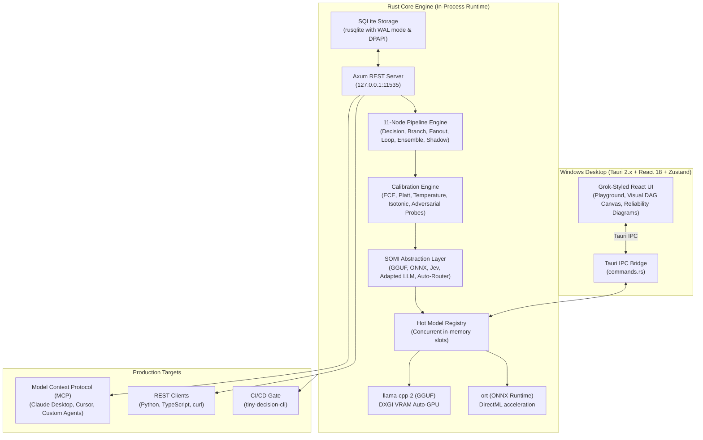

# ⚡ Tiny Decision

<p align="center">
  
</p>

<p align="center">
  <strong>A Local Harness & Deployment Platform for System One AI Models on Windows</strong><br>
  <em>Sub-50ms in-process decisions, empirical calibration trust, visual DAG pipelines, and one-click MCP agent tool export.</em>
</p>

<p align="center">
  <a href="https://github.com/aryanthegamedev3465-collab/tiny-decision/releases"></a>
  <a href="./LICENSE"></a>
  <a href="#"></a>
  <a href="./docs/SOMI_SPEC.md"></a>
  <a href="#"></a>
</p>

---

## 🌟 Why Tiny Decision?

LM Studio became the trusted, polished local home for prose-generation models (Llama, Mistral). But **System One models** (Jev-class, typed classification & regression heads) are a fundamentally distinct category: **they don't generate freeform text — they make instant, structured decisions.**

Tiny Decision owns the three pillars needed for this category:

1. **The Calibration Trust Moat:** The fatal flaw of small decision models is that *"confident ≠ correct"*. Tiny Decision makes calibration measurable and actionable: Expected Calibration Error (ECE) tracking, visual Reliability Diagrams, and **post-hoc recalibration** (Temperature & Platt scaling) that fixes confidence **with zero model retraining**.
2. **Prototype to Production:** Test a decision in the visual workbench $\rightarrow$ evaluate 10,000 rows in the batch runner $\rightarrow$ **ship as an MCP tool** or local REST API (`127.0.0.1:11535`) in one click.
3. **Vendor Neutrality (SOMI):** Tiny Decision defines the open **System One Model Interface (SOMI)**. Any current or future model vendor (local GGUF, local ONNX, Jev hosted API, OpenRouter) plugs in through the identical contract.

---


---

## 🏗️ Architecture

Tiny Decision embeds inference runtimes **in-process** in Rust (Tauri 2.x backend) to eliminate the 20–50ms process-boundary IPC hop common in Python sidecars.



---

## ⚡ Quick Start

### Option A: Download the Windows App (Recommended)
Download the latest portable release from **[Releases](https://github.com/aryanthegamedev3465-collab/tiny-decision/releases)**:
1. Download `tiny-decision-v1.0.0-windows-x64.zip`.
2. Extract the folder anywhere on Windows 10/11.
3. Double-click `Tiny Decision.bat` or run `td.exe`.

### Option B: Run from Source

```powershell
# 1. Clone repository
git clone https://github.com/aryanthegamedev3465-collab/tiny-decision.git
cd tiny-decision

# 2. Run the frontend in dev mode
cd app
npm install
npm run dev

# 3. Build the CLI binary
cd ..
cargo build --release --bin td
```

---

## 🔌 System One Model Interface (SOMI v1)

Every model in Tiny Decision satisfies the uniform SOMI HTTP contract:

```http
POST http://127.0.0.1:11535/somi/v1/decide
Content-Type: application/json

{
  "state": {
    "order_id": "ORD-94182",
    "customer_tier": "platinum",
    "item_condition": "unopened",
    "days_since_delivery": 4
  },
  "questions": [
    {
      "type": "Noul",
      "id": "q_eligible",
      "text": "Is this customer eligible for an immediate full refund?"
    }
  ]
}
```

### Response:
```json
{
  "answers": [
    {
      "question_id": "q_eligible",
      "type": "Noul",
      "value": true,
      "confidence": 0.942,
      "raw_confidence": 0.910,
      "probability": 0.942,
      "latency_ms": 28
    }
  ],
  "latency_ms": 28,
  "model_version": "jev-decision-1.5b"
}
```

---

## 🤖 MCP Export — Ship Decisions as Agent Tools

Any decision template can be published as an MCP tool directly into **Claude Desktop** or **Cursor**.

Add this to your `claude_desktop_config.json`:

```json
{
  "mcpServers": {
    "tiny-decision": {
      "command": "node",
      "args": ["C:/path/to/tiny-decision/docs/mcp-server.js"]
    }
  }
}
```

Now, Claude can call `decide_refund_eligibility({ state: { ... } })` as a native sub-50ms tool with zero custom glue code.

---

## 📊 The Calibration Suite

### Expected Calibration Error (ECE)
$$\text{ECE} = \sum_{m=1}^{M} \frac{|B_m|}{N} \left| \text{acc}(B_m) - \text{conf}(B_m) \right|$$

- **Reliability Diagrams:** Plots reported confidence buckets against empirical accuracy.
- **Post-Hoc Recalibration:** Fits Temperature scaling ($T$), Platt scaling ($A, B$), or non-parametric Isotonic regression.
- **Adversarial Probe Generator:** Automatically perturbs state text (conflict injection, prompt injection overrides, negation swaps) to stress-test fragile boundaries.
- **Cost-Matrix Threshold Tuning:** Minimizes enterprise financial risk based on the cost of false positives, false negatives, and human escalations.

---

## 📦 Project Layout

```
tiny-decision/
├── assets/                         # Curated models manifest & app logo
├── app/                            # React 18 + TypeScript + Tailwind frontend
│   ├── src/pages/                  # Models, Playground, Batch, Pipelines, Calibration, etc.
│   └── src-tauri/                  # Tauri 2.x desktop configuration & commands
├── core/                           # Rust core library (inference, SOMI, calibration, server)
├── cli/                            # tiny-decision-cli (td binary)
├── docs/                           # SOMI spec, plugin guide, architecture, OpenAPI spec
└── plugins/examples/               # WASM plugins (Slack alert, OpenRouter adapter)
```

---

## 📜 License

MIT License © 2026 Tiny Decision Authors. See [`LICENSE`](./LICENSE) for details.
