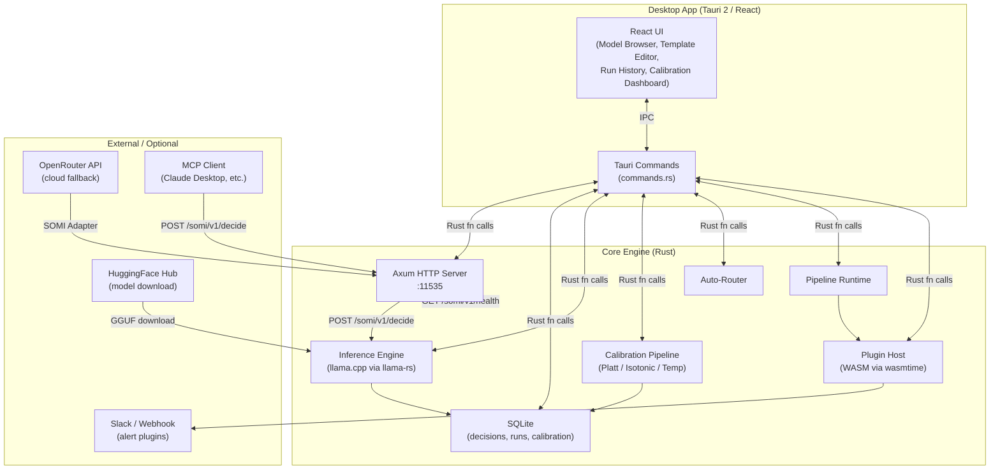

# Tiny Decision

> **Make fast, calibrated, explainable yes/no decisions with System One AI models — locally, privately, and blazingly quickly.**

[](https://github.com/tinydecision/tiny-decision/actions/workflows/build.yml)
[](./LICENSE)
[](https://www.rust-lang.org/)

---

## Table of Contents

1. [What is Tiny Decision?](#what-is-tiny-decision)
2. [Architecture](#architecture)
3. [Quick Start](#quick-start)
4. [Build Steps](#build-steps)
5. [SOMI Specification](#somi-specification)
6. [Plugin Authoring Guide](#plugin-authoring-guide)
7. [CLI Usage](#cli-usage)
8. [MCP Integration](#mcp-integration)
9. [License](#license)

---

## What is Tiny Decision?

**Tiny Decision** is a desktop-first, privacy-preserving AI decision engine. It runs small, fast **System One** (Jev-class) models locally to answer structured classification questions — and gives you calibrated confidence scores, cost-optimal thresholds, and full audit logs.

### Use Cases

| Domain | Example Question |
|---|---|
| Customer Support | Should this ticket be escalated to a human? |
| E-commerce | Is this return request eligible for an automatic refund? |
| Content Moderation | Is this email spam / phishing? |
| HR / Ops | Does this applicant meet minimum screening criteria? |
| Finance | Does this transaction look anomalous? |

### Why "System One"?

System One thinking is fast, pattern-based, and low-cost. LLMs sized 1B–7B parameters (Phi-2, Gemma-2-2B, Qwen-1.5-1.8B, etc.) make excellent System One classifiers when prompted correctly. Tiny Decision wraps these models behind the **SOMI** (System One Model Interface) HTTP contract so every model looks identical to your application.

### Key Features

- 🏠 **Fully local** — no data leaves your machine (unless you choose OpenRouter adapter)
- ⚡ **Sub-100 ms decisions** on Apple Silicon / modern CPUs via llama.cpp GGUF
- 📊 **Calibration** — Platt scaling, isotonic regression, temperature scaling
- 🔀 **Auto-Router** — automatically selects the smallest model that meets your accuracy + latency SLA
- 🧩 **Plugin system** — WASM-sandboxed plugins for adapters, alerting, ETL nodes
- 🔌 **MCP compatible** — expose any Decision Template as an MCP tool
- 🖥️ **Native desktop UI** — built with Tauri 2 + React (TypeScript)
- 📟 **CLI** — `td eval`, `td run`, `td models` — CI/CD friendly

---

## Architecture



### Component Overview

| Component | Location | Purpose |
|---|---|---|
| **Tauri App** | `app/src-tauri/` | Desktop shell, system tray, IPC bridge |
| **Core Crate** | `core/` | Shared types, DB, inference, calibration |
| **CLI Crate** | `cli/` | `td` binary for CI/CD |
| **Plugin Host** | `core/src/plugins/` | WASM sandbox via wasmtime |
| **Axum Server** | `app/src-tauri/src/server.rs` | SOMI-compliant HTTP API |
| **SQLite DB** | `~/.tiny-decision/db.sqlite3` | Decisions, runs, calibration params |

---

## Quick Start

### Prerequisites

| Tool | Version | Notes |
|---|---|---|
| Rust | 1.77+ | `rustup update` |
| Node.js | 20+ | For Tauri frontend |
| pnpm | 8+ | `npm i -g pnpm` |
| Tauri CLI | 2.x | `cargo install tauri-cli` |

### 1. Clone

```bash
git clone https://github.com/tinydecision/tiny-decision.git
cd tiny-decision
```

### 2. Install Frontend Dependencies

```bash
cd app
pnpm install
```

### 3. Download a Model

```bash
# Via CLI
cargo run -p td-cli -- models download microsoft/phi-2 --quant Q4_K_M

# Or use the in-app Model Browser
```

### 4. Run in Development Mode

```bash
# From repo root
cargo tauri dev
```

### 5. Make Your First Decision

```bash
curl -X POST http://localhost:11535/somi/v1/decide \
  -H "Content-Type: application/json" \
  -d '{
    "model_id": "microsoft/phi-2",
    "template_id": "refund-eligibility",
    "state": {
      "order_value": 45.99,
      "days_since_purchase": 12,
      "customer_tier": "gold"
    },
    "questions": [
      { "id": "eligible", "type": "choice", "text": "Is this return eligible for an automatic refund?", "choices": ["yes", "no"] }
    ]
  }'
```

---

## Build Steps

### Development Build

```bash
cargo tauri dev
```

### Production Build (Windows)

```bash
cargo tauri build
# Outputs: app/src-tauri/target/release/bundle/
#   - msi/   (MSIX)
#   - nsis/  (NSIS installer)
```

### CLI Only

```bash
cargo build -p td-cli --release
# Binary: target/release/td.exe (Windows) / td (Linux/macOS)
```

### Run Tests

```bash
cargo test --workspace
```

### CI Eval (for pipelines)

```bash
td eval \
  --template refund-eligibility \
  --eval-set ./evals/refund-v2.jsonl \
  --fail-under-accuracy 0.92 \
  --fail-over-ece 0.05
```

---

## SOMI Specification

> **SOMI** (System One Model Interface) is the HTTP contract that all models and adapters in Tiny Decision must satisfy. See [`docs/SOMI_SPEC.md`](./docs/SOMI_SPEC.md) for the full specification.

### At a Glance

**POST `/somi/v1/decide`**

```json
{
  "model_id": "microsoft/phi-2",
  "template_id": "refund-eligibility",
  "state": { "order_value": 45.99, "customer_tier": "gold" },
  "questions": [
    {
      "id": "eligible",
      "type": "choice",
      "text": "Is this return eligible for automatic refund?",
      "choices": ["yes", "no"]
    }
  ],
  "options": {
    "calibrate": true,
    "temperature": 0.0
  }
}
```

**Response:**

```json
{
  "run_id": "run_01J9XK...",
  "model_id": "microsoft/phi-2",
  "template_id": "refund-eligibility",
  "answers": [
    {
      "question_id": "eligible",
      "value": "yes",
      "probabilities": { "yes": 0.87, "no": 0.13 },
      "confidence": 0.87,
      "calibrated": true,
      "latency_ms": 42
    }
  ],
  "total_latency_ms": 44,
  "somi_version": "v1"
}
```

### Question Types

| Type | Description | Example |
|---|---|---|
| `choice` | Pick one from N choices | `{"type":"choice","choices":["yes","no","maybe"]}` |
| `noul` | Null or value (present/absent) | `{"type":"noul","label":"escalate"}` |
| `score` | 0–1 continuous score | `{"type":"score","label":"risk_score"}` |

### Badges

- 🏅 **Native** — model produces direct logit probabilities for each choice token (no prompt engineering needed)
- 🔌 **Adapted** — model is wrapped by a SOMI Adapter plugin that extracts probabilities via prompt + parsing

---

## Plugin Authoring Guide

> Full guide: [`docs/PLUGIN_AUTHORING.md`](./docs/PLUGIN_AUTHORING.md)

Plugins are **WASM modules** compiled from Rust (or any WASM-capable language) and sandboxed by `wasmtime`. They declare capabilities in a `plugin.json` manifest.

### Plugin Types

| Type | Interface | Use Case |
|---|---|---|
| `somi_adapter` | `decide(request) -> response` | Wrap a cloud/local model behind SOMI |
| `pipeline_node` | `process(node_input) -> node_output` | Custom ETL, alerting, formatting |
| `eval_metric` | `compute(predictions, labels) -> metrics` | Custom calibration/eval metrics |

### Quick Plugin Example

```toml
# plugins/my-plugin/Cargo.toml
[package]
name = "my-alert-plugin"
version = "0.1.0"
edition = "2021"

[lib]
crate-type = ["cdylib"]

[dependencies]
tiny-decision-sdk = "0.1"
```

```rust
// plugins/my-plugin/src/lib.rs
use tiny_decision_sdk::prelude::*;

#[plugin_node]
pub fn process(input: NodeInput) -> Result<NodeOutput> {
    let decision = input.get_str("decision")?;
    if decision == "escalate" {
        http_post("https://hooks.slack.com/...", json!({ "text": "Escalation triggered!" }))?;
    }
    Ok(NodeOutput::passthrough(input))
}
```

```bash
cargo build --target wasm32-wasi --release
td plugin install ./target/wasm32-wasi/release/my_alert_plugin.wasm --manifest plugin.json
```

---

## CLI Usage

```
USAGE:
    td <COMMAND>

COMMANDS:
    eval        Evaluate a template against an eval set (CI-friendly)
    run         Run a pipeline or single decision
    models      Model management (list, download, info)
    server      Start or stop the local SOMI server
    plugin      Plugin management (install, list, remove)
    help        Print this message or the help of the given subcommand(s)
```

### `td eval`

```bash
td eval \
  --template refund-eligibility \
  --eval-set ./evals/refund-v2.jsonl \
  --fail-under-accuracy 0.92 \
  --fail-over-ece 0.05
```

Exits with code `1` if accuracy < 0.92 or ECE > 0.05. Perfect for CI gates.

### `td run`

```bash
# Run a single decision
td run \
  --pipeline refund-eligibility \
  --state '{"order_value": 45.99, "customer_tier": "gold"}'

# Run from file
td run --pipeline refund-eligibility --state ./state.json
```

### `td models`

```bash
# List locally cached models
td models list

# Download from HuggingFace Hub
td models download microsoft/phi-2 --quant Q4_K_M

# Show model card
td models info microsoft/phi-2
```

### `td server`

```bash
# Start on default port 11535
td server start

# Start on custom port
td server start --port 8080

# Stop
td server stop
```

---

## MCP Integration

Tiny Decision can expose any Decision Template or Pipeline as an **MCP (Model Context Protocol) tool**, making it directly callable by Claude Desktop, Cursor, or any MCP-compatible host.

```bash
# Publish a template as an MCP tool
td mcp publish --template refund-eligibility
```

This registers the tool in the MCP manifest at `~/.tiny-decision/mcp-tools.json`. Add this to your Claude Desktop config:

```json
{
  "mcpServers": {
    "tiny-decision": {
      "command": "td",
      "args": ["server", "start", "--mcp"]
    }
  }
}
```

See [`docs/mcp-examples/`](./docs/mcp-examples/) for example tool manifests.

---

## License

MIT License © 2026 Tiny Decision Authors. See [`LICENSE`](./LICENSE).
